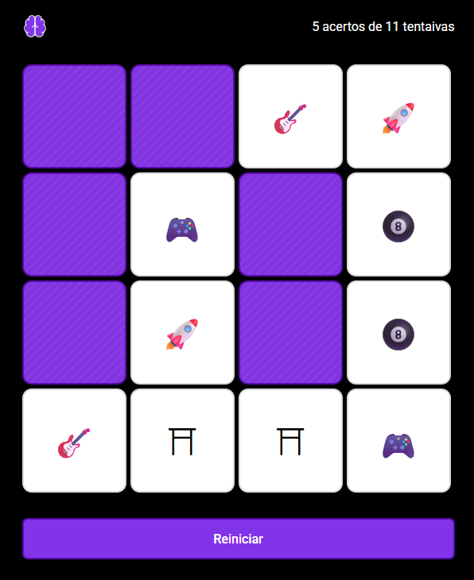

# 🃏 Jogo da Memória

## 📷 Preview

Aqui está um exemplo de como o jogo funciona:

## 🚀 Demonstração

👉 [Acesse o jogo aqui](https://ggccampos.github.io/Memory_Game/)  

---

## 📖 Como Jogar

1. Clique em uma carta para virá-la.  
2. Clique em outra carta para tentar formar um par.  
3. Se as cartas forem iguais ✅, elas permanecerão viradas.  
4. Se forem diferentes ❌, ambas voltarão para a posição inicial após alguns segundos.  
5. Continue virando cartas até encontrar todos os pares.  
6. Tente finalizar o jogo no **menor número de jogadas possível**.  

💡 Dica: use a memória para lembrar onde estão as cartas já viradas!  
---

## 🛠️ Tecnologias Utilizadas

- **HTML5** → Estrutura do jogo  
- **CSS3** → Estilização e responsividade  
- **JavaScript (ES6)** → Lógica e interatividade  

---

## 📂 Estrutura do Projeto
- index.html # Estrutura principal do jogo
- style.css # Estilos e design da interface
- script.js # Lógica do jogo (embaralhar, verificar pares, reiniciar)
- assets/ # Imagens, ícones e capas

---
## 🎮 Funcionalidades

- 🔀 Embaralhamento automático das cartas a cada partida  
- 🎴 Virar cartas com clique e verificar pares iguais  
- ⏱️ Contagem de jogadas realizadas  
- ✅ Indicação visual de acertos e erros  
- 🔁 Botão de reinício para começar uma nova partida  
- 📱 Layout responsivo para desktop e mobile  

---

✉️ Desenvolvido por Gabriel Campos